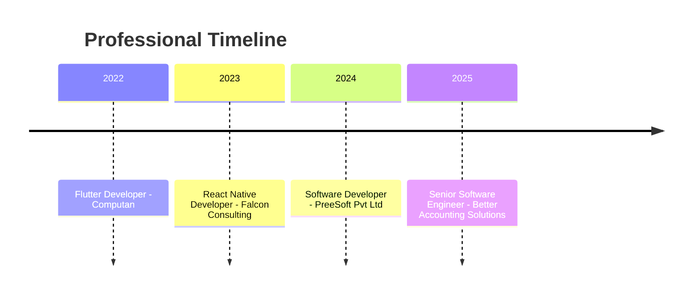
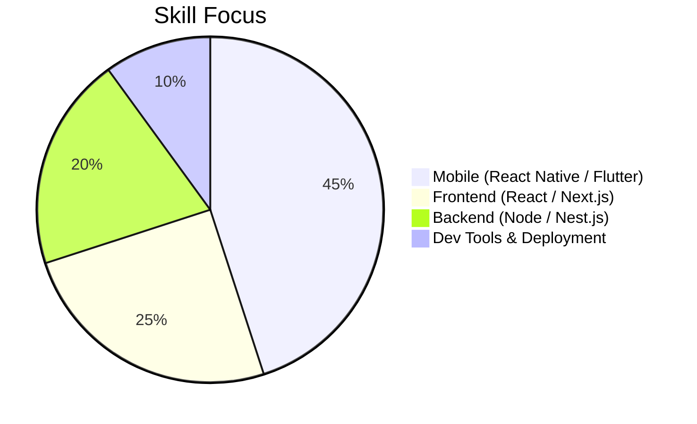

# Muhamed Saif
### Senior Software Engineer | React Native & Full-Stack (US Remote)

Building scalable, user-centric products across mobile and web platforms for startups and growth-stage teams.  
Specialized in React Native, Flutter, React.js/Next.js, Node.js/Nest.js, and secure API-driven architecture.

---

## Professional Summary

Results-driven software engineer with 4+ years of experience delivering production-ready mobile and web applications for startups and international clients. Strong background in React Native, Flutter, React.js/Next.js, Node.js/Nest.js, and MongoDB, with hands-on expertise in secure API architecture, third-party integrations, and app deployment across Google Play and Apple App Store Connect. I work effectively with remote teams and communicate clearly with both technical and non-technical stakeholders.

---

## Core Expertise

- Cross-platform mobile development with React Native and Flutter
- Full-stack web development with React.js/Next.js and Node.js/Nest.js
- REST API integration, third-party SDKs, and secure authentication workflows (JWT, OAuth)
- Scalable backend services, MongoDB data modeling, and cloud-based deployment pipelines
- Agile collaboration with remote and cross-functional engineering teams

---

## Why Clients & Recruiters Work With Me

- Product mindset: I focus on business goals, not only code.
- Reliable delivery: I own features from planning to production release.
- Clear communication: async-friendly updates, proactive problem solving.
- Quality-first engineering: maintainable architecture, strong debugging, clean UI.

---

## Professional Experience

### Senior Software Engineer (Freelance) - Better Accounting Solutions
*Sep 2025 - Present | Remote, United States*
- Developing CRM-based web and mobile products for US-based clients.
- Building frontend systems with React.js/Next.js and backend services with Node.js/Nest.js and MongoDB.
- Designing secure API architecture and integrating Teller, Plaid, and Decision Logic.
- Delivering end-to-end features from development through deployment in agile remote teams.

### Software Developer | Mobile App Developer - Preesoft Pvt Ltd
*Feb 2024 - Feb 2026 | Lahore, Pakistan*
- Delivered scalable iOS and Android applications with React Native.
- Improved app reliability through robust API integrations and production issue resolution.
- Supported releases for Google Play Store and Apple App Store Connect.

### Mobile Application Developer (Freelance) - Upwork
*May 2022 - Apr 2024 | Remote*
- Built and maintained mobile apps for multiple clients with varying product requirements.
- Provided end-to-end implementation from planning and development to deployment support.

### Software Developer | React Native Developer - Falcon Consulting
*Feb 2023 - Feb 2024 | Lahore, Pakistan*
- Developed cross-platform mobile applications with React Native for Android and iOS.

### Flutter Developer (Part-time) - Computan
*Sep 2022 - Feb 2023 | Lahore, Pakistan*
- Contributed to Flutter projects and strengthened mobile engineering fundamentals.

---

## Selected Projects

- **BAS CRM (Multi-tenant Platform):** Built with Next.js, Nest.js, TypeScript, and MongoDB. Implemented modules for client and project management, messaging, Plaid/Stripe integrations, RBAC, and AI-assisted workflows.
- **MCA Funder CRM:** Developed full-stack deal lifecycle modules with Node.js, Express, MongoDB, and Next.js, including underwriting, ACH flows, reporting, and customizable funder operations.
- **Ezelogs (Construction Platform):** Contributed to scalable web/backend modules, workflow automation, and third-party integrations for enterprise construction operations.
- **Dar-e-Arqam App / Ezelogs App / Serendipity:** Delivered React Native mobile apps with Firebase and API integrations, published for real-world users.

---

## Career & Skills Snapshot

---

## GitHub Highlights

  
  
  

  
  

---

## Education

**BS Computer Science**  
The University of Lahore (Aug 2019 - Jan 2023)

---

## Tech Stack

**Mobile:** React Native, Flutter, Dart  
**Frontend:** React.js, Next.js, JavaScript, TypeScript, Redux, HTML, CSS, Tailwind, Bootstrap  
**Backend:** Node.js, Nest.js, Express.js, REST APIs, WebSockets, Firebase, Supabase  
**Databases:** MongoDB, SQLite, SQL  
**Tools:** Git, GitHub, Postman, Android Studio, Xcode, VS Code, Figma, Docker

---

## Open To

- US-remote Senior Mobile Engineer / React Native Engineer roles
- Full-Stack Engineer roles (React/Next + Node/Nest)
- Long-term freelance and contract engagements
- Product teams focused on scalable, high-impact platforms
