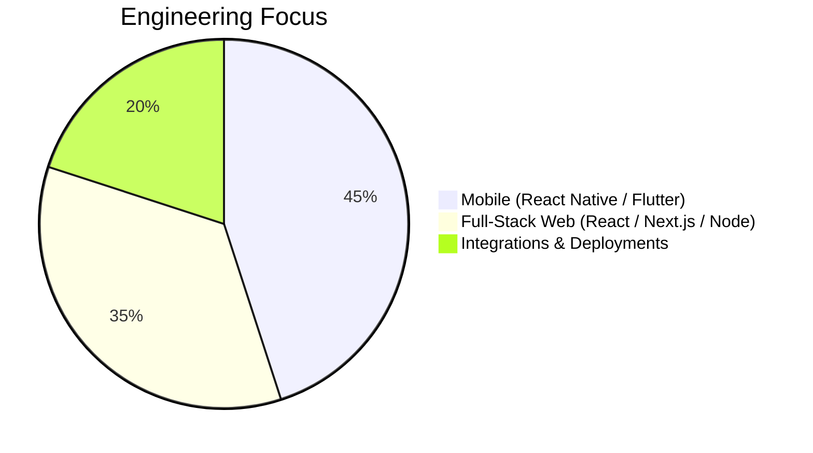

# Muhamed Saif
### Senior Software Engineer | React Native & Full-Stack (US Remote)

I build reliable mobile and web products that are fast, scalable, and user-focused.

---

## At A Glance

- 4+ years building cross-platform apps and full-stack systems
- Core stack: React Native, Flutter, React.js/Next.js, Node.js/Nest.js, MongoDB
- Experience shipping production apps to Google Play and App Store Connect
- Remote collaboration with US-based teams and international clients

---

## What I Deliver

- End-to-end product features from idea to deployment
- Clean, maintainable code with performance-first architecture
- Secure API integrations (Plaid, Teller, payments, OAuth/JWT)
- Clear communication and dependable execution

---

## Featured Work

- **BAS CRM:** Multi-tenant CRM with Next.js + Nest.js + MongoDB, including finance integrations, RBAC, and real-time modules.
- **MCA Funder CRM:** Deal lifecycle platform with underwriting, ACH flows, reporting, and customizable operations.
- **Ezelogs:** Construction management platform with scalable web/backend modules and workflow automation.
- **Published Mobile Apps:** Dar-e-Arqam, Ezelogs, Serendipity, and other production React Native apps.

---

## Experience Snapshot

| Role | Company | Period |
|---|---|---|
| Senior Software Engineer (Freelance) | Better Accounting Solutions | Sep 2025 - Present |
| Software Developer / Mobile App Developer | PreeSoft Pvt Ltd | Feb 2024 - Feb 2026 |
| Mobile Application Developer (Freelance) | Upwork | May 2022 - Apr 2024 |
| React Native Developer | Falcon Consulting | Feb 2023 - Feb 2024 |

---

## Tech Stack

**Mobile:** React Native, Flutter, Dart  
**Frontend:** React.js, Next.js, JavaScript, TypeScript, Redux, Tailwind  
**Backend:** Node.js, Nest.js, Express.js, REST APIs, WebSockets  
**Data & Tools:** MongoDB, Firebase, Supabase, Git, Postman, Docker

---

## GitHub Highlights

  
  

  

---

## Open To

- US-remote Senior Mobile Engineer / React Native Engineer roles
- Full-Stack Engineer roles (React/Next + Node/Nest)
- Long-term freelance and contract projects
